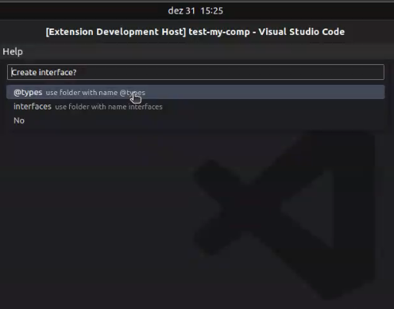

# React Component Generator

This guide explains how to use the extension that streamlines the process of generating React components, including associated files and options for styling and testing.

## Overview

This extension, upon receiving a component name, generates a test file using the [testing-library react](https://testing-library.com/react) library. It also provides style options, including:
- [Styled-Components](https://styled-components.com/)
- Style without a library
- No styling

## Usage

### Step 1:
#### Right Click:
- After installing the extension, select the folder and perform a  mouse `Right Click`.
- Select the `generate react component` option


#### Command Palette:
- After installing the extension, open the command palette using `Ctrl+Shift+P` or `Cmd+Shift+P`.
- Type `generate react component` and press `Enter` to initiate component generation.


### Step 2:
- Enter the component name and press `Enter`.


### Step 3:
- Choose the destination folder for the component or stick with the default path (`src/components`).
- `Note: The Default folder option is currently unavailable but will be soon.`


### Step 4:
- Select component type.
- Options include `Component` or `Page`.


### Step 5:
- Select the desired style library.
- Options include `Styled-Components`, `Style without library`, or `Without style`.



### Step 6:
- Indicate whether you want to generate an interface for the component.
- Choose between `Yes` or `No`.


### Step 7:
- Choose the file name format.
- Available formats: `Kebab Case` and `Pascal Case``.
- Examples:
  - KebabCase:
    - `button-submit-styles.ts`
    - `button-submit.spec.tsx`
    - `button-submit.tsx`
    - `index.ts`
  - PascalCase:
    - `ButtonSubmit-styles.ts`
    - `ButtonSubmit.spec.tsx`
    - `ButtonSubmit.tsx`
    - `index.ts`


### Result:
- All generated files contain the starting code for each respective type.


### About the Files
- `button-styles.ts`: Style file for the component.
- `button.spec.tsx`: Test file for the component with [testing-library react](https://testing-library.com/react).
- `button.tsx`: Component file for the component.
- `index.ts`: Index file for exporting the component.

## Requirements

If you want to use the style library `Styled-Components`, you need to install the `styled-components` package.
```bash
npm install styled-components
```
If you want to use the test library `testing-library react`, you need to install the `@testing-library/react` package.
```bash
npm install @testing-library/react
```

## Contributors

[](https://github.com/jhersonharyson/generate-react-component/graphs/contributors)

## License

This project is under the MIT license. See the [LICENSE](LICENSE.md) file for more details.


